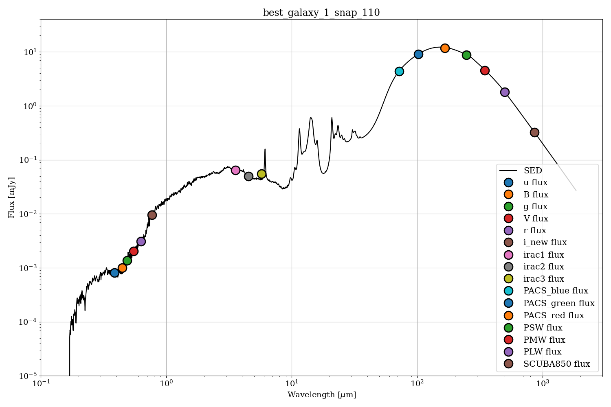

# What's new

Users can now synthesize SEDs from SIMBA simulation data by applying CIGALE filter sets. Furthermore, the tool supports the derivation of physical galaxy parameters, specifically FIR luminosity, dust temperature, and infrared star formation rates ($SFR_{IR}$).

